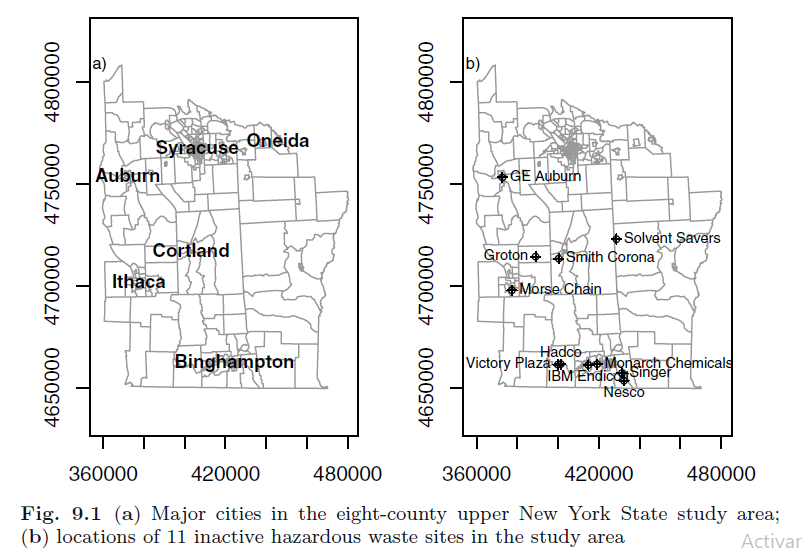
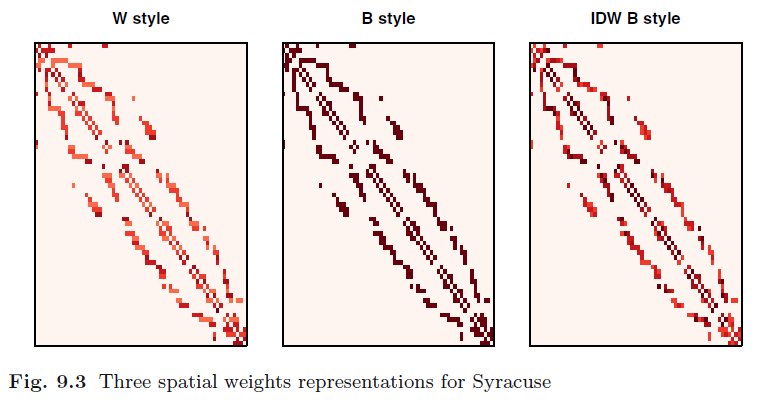
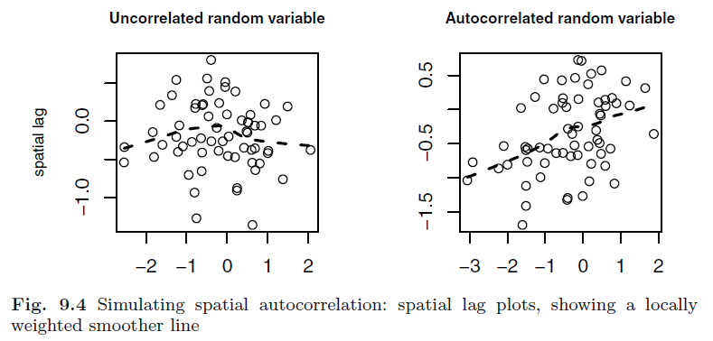

```{r setup, include=FALSE}
knitr::opts_chunk$set(echo = TRUE)
```


# Modelación de datos en área

## 9.1 Introducción

Es los datos espaciales en común encontrar entidades poligonales con limites definidos. Los límites de los polígonos pueden ser definidos por un investigador (en algunos campos de estudio), pueden ser arbitrarios o pueden ser limites creados con diferentes propósitos. Los datos espaciales observados son con frecuencia agregaciones dentro de los limites, como conteos de la población. Las entidades territoriales en sí mismas pueden definir o constituir las unidades de observación. 

En general las entidades de área son agregados, es decir, se utilizan para contar ciertas medidas. Muy a menudo, las entidades de área son una teselación exhaustiva del área de estudio, sin dejar ninguna parte del área total sin asignar a una entidad. Las entidades de área pueden esta formadas por múltiples entidades además de contener agujeros.

Los límites de las entidades de área pueden definirse con propósitos diferentes al análisis de datos. Los cambios frecuentes en los límites son un problema importante para los análisis longitudinales. Los limites arbitrarios de las unidades de área son un problema si su modificación puede conducir a resultados diferentes, también puede presentarse un obstáculo en el análisis si la escala espacial (o la huella de un proceso de generación de datos) no coincide con los limites elegidos.

Si se diseña la recopilación de datos para hacer coincidir las entidades de área con los datos, se reducirá la influencia de la elección de los agregados.

Si nos vemos obligados a hacer uso de limites arbitrarios principalmente porque no existen otras fuentes viables de datos secundarios, debemos ser conscientes de las posibles dificultades y ésta es una de las principales razones por las que se puede encontrar autocorrelación espacial en el análisis de agregados de área, otra de las razones es cuando hay procesos espaciales en los que las entidades se influyen entre si por contagio y adicionalmente cuando hay una especificación errónea del modelo dejando información con patrones espaciales en los residuos; estas causas de autocorrelación espacial pueden ocurrir en combinación y es lo que hace interesante la identificación correcta de los procesos espaciales reales.   

Una amplia gama de disciplinas científicas se ha encontrado con la autocorrelación espacial entre entidades de área, el problema está en establecer cuantas observaciones efectivamente independientes están presentes, cuando se han utilizado limites arbitrarios para dividir un área de estudio. La dependencia espacial positiva tiende a reducir la cantidad de información contenida en las observaciones, porque las observaciones próximas pueden usarse en parte para predecirse entre sí.

En una superficie continua, todos los puntos son vecinos entre sí, aunque algunos pueden tener muy poco peso porque están muy distantes. En una superficie teselada se puede elegir definiciones vecinas que dividan al conjunto de todas las entidades (excluyendo la observación i) en miembros o no miembros del conjunto vecino de la observación i, también se puede tomar decisión de darle el mismo peso a cada relación vecina o variar los pesos en los arcos del gráfico que describe la dependencia espacial.

Primero se debe de construir los vecinos y los pesos para luego proceder a buscar formas de medir la autocorrelación espacial. También es interesante mostrar cómo se puede introducir la autocorrelación espacial en datos independientes de modo que se puedan realizar simulaciones.

<br>

* El conjunto de datos a trabajar en ejemplos posteriores es:

El conjunto de datos de 281 tramos censales para ocho condados centrales del estado de Nueva York destacados en Waller y Gotway (2004) El cual tiene una área con extensión de unos 160 km de norte a sur y 120 km de este a oeste.

<center>

</center>

La figura 9.1 muestra las principales ciudades del área de estudio y la ubicación de 11 sitios de desechos peligrosos. Las cifras de Waller y Gotway (2004) incluyen masas de agua, que no están presentes en esta versión de los límites de los tramos, en la que los límites de los tramos siguen las líneas centrales de los lagos, en lugar de sus orillas.


## 9.2 Vecinos espacial y pesos espaciales

La creación de ponderaciones espaciales es un paso necesario en el uso de datos de área, tal vez solo para verificar que no queden patrones espaciales en los residuos.

El primer paso es definir que relaciones del proceso se les dara un peso diferente de cero, es decir, elegir el criterio vecino a utilizar.

El segundo paso es asignar pesos a los enlaces vecinos identificados.

Tratar de detectar patrones en mapas de residuos visualmente no es una opción aceptable.

El prcoceso de crear los vecinos o los pesos no es nada fácil por lo que nos apoyamos de funciones del paquete spdep.


* Dado que el análisis de datos en área depende de las elecciones realizadas al construir las ponderaciones espaciales nos apoyamos en la creación de los objetos vecinos del paquete **spded** que dispone de unas viñetas interactivas ("nb") en donde se puede explorar sobre el tema de la creación de los vecinos, que incluyen discusiones sobre la creación y el uso de pesos espaciales y se puede acceder a través de:


```{r}
# Herramienta de exploración de la creación de vecinos
vignette("nb", package = "spdep")
```

<br>

### 9.2.1 Objetos vecinos

En el paquete spdep, las relaciones vecinas entre n observaciones están representadas por un objeto de clase **nb**, es una lista de longitud n con los números indice de los vecinos de cada componente registrados como un vector entero, si alguna observación no tiene vecinos, el componente contiene un número entero cero.También contiene atributos, normalmente un vector de identificadores de región de caracteres y un valor lógico que indica si las relaciones son simetricas.

* Los identificadores de región se pueden usar para verificar la integridad entre los datos mismos y el objeto vecino.

* La tarjeta de función auxiliar devuelve la cardinalidad del conjunto vecino para cada objeto, es decir, el número de vecinos.


```{r}
# Carga de librerias
library(spdep)
library(rgdal)
<<<<<<< HEAD
library(spatialreg)

# Lectura de mapas espaciales como objetos vectoriales
=======
require(spatialreg)

>>>>>>> 06d2c6be09c7b6d92ffed5129ae7d959ee9f9cdb
NY8 <- readOGR(".", "NY8_utm18")

# Lectura de un archivo de área en una lista de vecinos
# Objeto nb
NY_nb <- read.gal("NY_nb.gal", region.id = row.names(NY8))

# Resumen de las propiedades del objeto nb
summary(NY_nb)
```


* Gráfico de vecinos completo para el área de estudio de los ocho condados

```{r}
plot(NY8, border = "grey60")
plot(NY_nb, coordinates(NY8), pch = 19, cex = 0.6, add = TRUE)
```


_Nota: contigüidades de la reina del distrito censal, donde todos los polígonos en contacto son vecinos, utilizado en Waller y Gotway (2004) y proporcionado como un archivo DBF en su sitio web, se creó un archivo de formato GAL y se leyó en R._

La Figura  anterior (9.2) muestra el gráfico de vecinos completo para el área de estudio de los ocho condados. En aras de la simplicidad al mostrar cómo crear objetos vecinos, trabajamos en un subconjunto del mapa que consiste en las secciones censales dentro de Syracuse, aunque los mismos principios se aplican al conjunto de datos completo. 

<br>

Tenemos un objeto **nb** para examinar, podemos presentar los métodos estándar para estos objetos, hay métodos de **print**, **summary**, **plot**, entre otros:

* el método de resumen presenta una tabla de distribución de números de enlace

* el método de impresión como el de resumen informan sobre la asimetría y la presencia de observaciones no vecinas; la asimetría está presente cuando $i$ es vecino de $j$ pero $j$ no es vecino de $i$. 


Recuperamos la parte de la lista de vecinos en Syracuse utilizando el método de subconjunto:


```{r}
#  Filtrando por el subconjunto de la ciudad de Syracuse 
Syracuse <- NY8[NY8$AREANAME == "Syracuse city", ]
Sy0_nb <- subset(NY_nb, NY8$AREANAME == "Syracuse city")
summary(Sy0_nb) # Resumen del objeto filtrado
```

<br>

Creamos una serie de objetos vecinos de otras maneras:

* Tres objetos k vecinos más cercanos: tomando $k$ puntos más cercanos como vecinos, para $k = 1, 2, 4$; esto se adapta a lo largo del área de estudio, teniendo en cuenta las diferencias en las densidades de las entidades de área. Naturalmente, en la gran mayoría de los casos, conduce a vecinos asimétricos, pero garantizará que todas las áreas tengan $k$ vecinos.

```{r}
# Coordenadas de la ciudad Syracuse
coords <- coordinates(Syracuse)
IDs <- row.names(Syracuse)

# Creación de los k vecinos más cercanos
Sy8_nb <- knn2nb(knearneigh(coords, k = 1), row.names = IDs)
Sy9_nb <- knn2nb(knearneigh(coords, k = 2), row.names = IDs)
Sy10_nb <- knn2nb(knearneigh(coords, k = 4), row.names = IDs)


# nbdists: calcula una lista de vectores de distancias correspondientes al objeto vecino
dsts <- unlist(nbdists(Sy8_nb, coords))
Sy11_nb <- dnearneigh(coords, d1 = 0, d2 = 0.75 * max(dsts),row.names = IDs)
```


El objeto $k = 1$ también es útil para encontrar la distancia mínima a la que todas las áreas tienen un vecino basado en la distancia. Usando la función **nbdists**, podemos calcular una lista de vectores de distancias correspondientes al objeto vecino, aquí para los primeros vecinos más cercanos. El mayor valor será la distancia mínima necesaria para garantizar que todas las áreas estén vinculadas con al menos un vecino, por lo que podemos crear fácilmente un objeto sin observaciones de vecinos al establecer el umbral superior por debajo de este valor.


<br>

## 9.2.2 Objetos de pesos espaciales

_Nota: La literatura sobre pesos espaciales es sorprendentemente pequeña, a pesar de su importancia para medir y modelar la dependencia espacial en datos de área._

* A continuación se da una contextualización y procedimiento de calculo de los pesos espaciales:

Los pesos espaciales se pueden ver como una lista de pesos indexados por una lista de vecinos, donde el peso del enlace entre $i$ y $j$ es el $k-ésimo$ elemento del $i-ésimo$ componente de la lista de pesos, y $k$ nos dice cuál de los $i-ésimos$ valores del componente de la lista de vecinos es igual a $j$. Si $j$ no está presente en el $i-ésimo$ componente de la lista de vecinos, $j$ no es vecino de $i$. En consecuencia, algunos pesos $w_{ij}$ en la representación de la matriz de pesos $W$ se pondrán a cero, donde $j$ no es vecino de $i$.


Una vez establecida la lista de conjuntos de vecinos para nuestra área de estudio, procedemos a asignar pesos espaciales a cada relación. Si tenemos poco conocimiento sobre el proceso espacial asumido, tratamos de evitar alejarnos de la representación binaria de un peso de unidad para los vecinos (Bavaud, 1998), y cero en caso contrario. 


A continuación abordamos las formas en que se construyen los objetos de pesos (objetos de lista). A continuación, se mostrará la conversión de estos objetos en representaciones matriciales densas y dispersas, concluyendo con funciones para importar y exportar objetos vecinos y pesos.

* La función **nb2listw** toma un objeto de lista de vecinos y lo convierte en un objeto de pesos. El estilo de conversión predeterminado es $W$, donde los pesos para cada entidad de área están estandarizados para sumar la unidad; esto también se denomina a menudo estandarización de filas. 

* El método de impresión para objetos **listw** muestra las características de los vecinos subyacentes, el estilo de las ponderaciones espaciales y las constantes de ponderaciones espaciales utilizadas para calcular las pruebas de autocorrelación espacial. El componente de vecinos del objeto es el objeto nb subyacente, que proporciona la indexación del componente de pesos.


```{r}
# Conversión a un objeto de pesos
Sy0_lw_W <- nb2listw(Sy0_nb)
Sy0_lw_W
```


```{r}
# Nombres del objeto de pesos
names(Sy0_lw_W)
```


```{r}
# Atributos asociados al objeto de pesos
names(attributes(Sy0_lw_W))
```


Notas relevantes:

* Es importante entender que para **style="W"**, los pesos varían entre la unidad dividida por el mayor y el menor número de vecinos, y las sumas de pesos para cada entidad de área son la unidad. Este estilo de pesos espaciales puede interpretarse como que permite el cálculo de valores promedio entre vecinos.

* Las ponderaciones de los enlaces que se originan en áreas con pocos vecinos son mayores que las que se originan en áreas con muchos vecinos, lo que quizás aumente las entidades de área en el borde del área de estudio sin querer. Esta representación ya no es simétrica, pero es similar a la simétrica.


```{r}
# Rango de valores de los pesos
1/rev(range(card(Sy0_lw_W$neighbours)))
summary(unlist(Sy0_lw_W$weights))
```

```{r}
# sumas de pesos para cada entidad de área
summary(sapply(Sy0_lw_W$weights, sum))
```


Establecer estilo="B"('binary') - retiene un peso de unidad para cada relación vecina, pero en este caso, las sumas de pesos para las áreas difieren según el número de áreas vecinas que tienen.

```{r}
# Pesos con style = "B"
Sy0_lw_B <- nb2listw(Sy0_nb, style = "B")
summary(unlist(Sy0_lw_B$weights))
```

```{r}
# sumas de pesos para cada entidad de área con style = "B" 
summary(sapply(Sy0_lw_B$weights, sum))
```

* El argumento **glist** se puede usar para pasar una lista de vectores de pesos generales correspondientes a las relaciones vecinas a **nb2listw**. Digamos que creemos que la fuerza de las relaciones de vecindad se atenúa con la distancia.


* Estrategia:

Se puede configurar los pesos para que sean proporcionales a la distancia inversa entre los puntos que representan las áreas, usando **nbdists** para calcular las distancias para el objeto **nb** dado. Usando lapply para invertir las distancias, podemos obtener una estructura de pesos espaciales diferente a las anteriores. Si no se tiene ninguna razón para suponer más conocimiento sobre las relaciones entre vecinos que su existencia o ausencia, este paso es potencialmente engañoso, por el contrario si sabemos que los flujos de migración o desplazamiento describen la estructura de los pesos espaciales mejor que la alternativa binaria, puede valer la pena usarlos como pesos generales; sin embargo, puede haber problemas de simetría, porque tales flujos, a diferencia de las distancias inversas, rara vez son simétricos.


```{r}
# pesos proporcionales a la distancia inversa
dsts <- nbdists(Sy0_nb, coordinates(Syracuse))
idw <- lapply(dsts, function(x) 1/(x/1000))
Sy0_lw_idwB <- nb2listw(Sy0_nb, glist = idw, style = "B")
summary(unlist(Sy0_lw_idwB$weights))
```


```{r}
# sumas de pesos para cada entidad de área
summary(sapply(Sy0_lw_idwB$weights, sum))
```

La Figura 9.3 muestra tres representaciones de ponderaciones espaciales para Syracuse mostradas como matrices. La imagen style="W" de la izquierda es evidentemente asimétrica, con colores más oscuros mostrando mayor peso para áreas con pocos vecinos. Los otros dos paneles son simétricos, pero expresan diferentes suposiciones sobre las fortalezas de las relaciones de vecindad.


<center>

</center>


**Nota importante:** 

El argumento final de nb2listw nos permite manejar listas de vecinos con áreas no vecinas. No es obvio que la representación del peso del conjunto vacío sea cero; tal vez debería ser NA, lo que generaría problemas más adelante. 

Por esta razón, el valor predeterminado del argumento es zero.policy=FALSE, lo que genera un error cuando se proporciona un argumento nb con áreas sin vecinos. Establecer el argumento en TRUE permite la creación del objeto de pesos espaciales, con pesos cero. El argumento zero.policy posteriormente deberá usarse en cada función llamada, a menos que se establezca TRUE para la sesión R actual con set.ZeroPolicyOption(TRUE). 

Bivand y Portnov (2004) analizan el contraste entre la comprensión basada en conjuntos de los vecinos y la conversión a una representación matricial, y se reduce a si el producto de los pesos de un área no vecina y un vector n arbitrario debe ser un valor faltante o cero numérico. Mantener las entidades de área no vecinas plantea preguntas sobre el tamaño relevante de n cuando se prueba la autocorrelación, entre otras cuestiones.

* Por lo tanto se espera que lo siguiente genere un error

```{r}
# Sy0_lw_D1 <- nb2listw(Sy11_nb, style = "B")
```


```{r}
# pesos con style = "B" y zero.policy = TRUE
Sy0_lw_D1 <- nb2listw(Sy11_nb, style = "B", zero.policy = TRUE)
print(Sy0_lw_D1, zero.policy = TRUE)
```


Propuesta de solución a los valores faltantes:

El problema paralelo de los conjuntos de datos con valores faltantes en las variables pero con pesos espaciales totalmente especificadas se aborda a través del método **subset.listw**, que vuelve a generar los pesos para el subconjunto de áreas dado, por ejemplo, dado por complete.cases. Sabiendo qué observaciones están incompletas, los vecinos y pesos subyacentes se pueden dividir en subconjuntos en algunos casos, con el objetivo de evitar la propagación de valores de NA al calcular valores espacialmente retrasados. Muchas pruebas y funciones de ajuste de modelos pueden llevar a cabo esto internamente si se establece el indicador de argumento apropiado.

Recomendación: Un analista cuidadoso prefiere un subconjunto de los datos de entrada y los pesos antes de probar o modelar.


<br>

### 9.2.3 Manejo de objetos de pesos espaciales

Hay varios paquetes de contribución que brindan soporte para matrices dispersas, entre los cuales estan:

- **Matrix** (paquete recomendado) 

- **as_dgRMatrix_listw** convierte un objeto listw en una matriz dispersa de matriz ordenada, comprimida y orientada a filas, como un objeto **dgRMatrix**(una subclase de la clase virtual RsparseMatrix).

Es más fácil hacer una matriz dispersa orientada a filas a partir de un objeto de pesos espaciales ya que los pesos están orientados a filas. 

* Una función que se utiliza mucho en las funciones de prueba y ajuste de modelos es listw2U, que devuelve un objeto listw simétrico que representa la matriz de ponderaciones espaciales $\frac{1}{2}(W + W^T)$.


- Los objetos vecinos y de pesos producidos en otro software se pueden importar a R sin dificultad y dichos objetos también se pueden exportar a otro software.

**Ejemplo.**

Se generan algunos archivos en GeoDa a partir de las secciones del censo de Syracuse escritas como un archivo de forma, con el centroide utilizado aquí almacenado en el marco de datos. Los dos primeros son para vecinos de contigüidad, utilizando los criterios de dama y torre, respectivamente. Estos archivos de formato GAL contienen solo información de vecinos y se describen en detalle en el archivo de ayuda que acompaña a la función read.gal.

```{r}
# Lectura del archivo en formato GAL
Sy14_nb <- read.gal("Sy_GeoDa1.GAL")

# Validación de la igualdad de los formatos
isTRUE(all.equal(Sy0_nb, Sy14_nb, check.attributes = FALSE))
```


La función **write.nb.gal** se utiliza para escribir archivos en formato GAL a partir de objetos nb. 

GeoDa también crea archivos en formato GWT, descritos en la documentación de GeoDa y el archivo de ayuda, que también contienen información de distancia para el vínculo entre las áreas y se almacenan en una representación dispersa de tres columnas. Se pueden leer usando **read.gwt2nb**, aquí para un esquema de cuatro vecinos más cercanos, y solo usando los enlaces vecinos.


```{r}
# Lectura del archivo en formato GWT
Sy16_nb <- read.gwt2nb("Sy_GeoDa4.GWT")

# Validación de la igualdad de los formatos
isTRUE(all.equal(Sy10_nb, Sy16_nb, check.attributes = FALSE))
```

Un conjunto similar de funciones está disponible para intercambiar pesos espaciales con la libreria **the Spatial Econometrics**. La representación dispersa de los pesos es similar al formato **GWT** y se puede importar usando **read.dat2listw**.


* La exportación a tres formatos diferentes pasa por la función **listw2sn**, que convierte un objeto de pesos espaciales en una representación dispersa de tres columnas. 

* El marco de datos de salida se puede escribir como un archivo de formato GWT con **write.sn2gwt** o como una representación de texto de una matriz dispersa para Matlab™ con **write.sn2dat**.


* Los archivos escritos usando **write.sn2gwt** se pueden leer en Stata™ con spmat import W using.

* Hay una función llamada **listw2WB** para crear una lista de pesos espaciales para WinBUGS, que se escribirán en un archivo usando dput. 

* Para objetos vecinos, se puede usar **nb2WB**, configurando todos los pesos a la unidad. De manera similar, un objeto vecino puede exportarse a un archivo con **nb2INLA**, para pasar datos al argumento del gráfico para el modelo "bym" en ajuste usando inla. 


* También es posible usar **nb2gra** en el paquete **BayesX** para convertir objetos nb al formato gráfico gra.


* El **mat2listw** se puede usar para revertir el proceso, cuando una matriz de pesos se ha leído en R y se debe convertir en un objeto vecino y de lista de pesos. Desafortunadamente, esta función no establece el estilo del objeto listw en un valor conocido, usando **M** para señalar esta falta de conocimiento. Entonces es habitual reconstruir el objeto listw, tratando el componente de vecinos como un objeto **nb**, el componente de pesos como una lista de pesos generales y estableciendo el estilo en la función **nb2listw** directamente. 


* Finalmente, hay una función **nb2lines** para convertir listas de vecinos en objetos **SpatialLinesDataFrame**, dadas las coordenadas de los puntos que representan las áreas. Esto permite trazar objetos vecinos de forma alternativa y, si es necesario, exportarlos como archivos de forma.


<br>

### 9.2.4 Uso de pesos para simular la autocorrelación espacial

<center>

</center>

En la figura anterior (Fig. 9.3), se hizo uso de **listw2mat** para convertir un objeto de pesos espaciales en una matriz densa para su visualización. La misma función se usa para construir una representación densa de la matriz $(I − ρW)$ para simular la autocorrelación espacial dentro de la función **invIrW**, donde $W$ es una matriz de pesos, $ρ$ es un coeficiente de autocorrelación espacial e $I$ es la matriz identidad. Este enfoque fue introducido por Cliff y Ord (1973, pp. 146-147), y no impone condiciones estrictas sobre la matriz a invertir (solo que no sea singular), y solo se aplica a simulaciones de un proceso autorregresivo simultáneo. 

A continuación se realiza la simulación comenzando con un vector de números aleatorios correspondientes al número de distritos censales en Syracuse, usamos los pesos de contigüidad estandarizados por filas para introducir la autocorrelación:

```{r}
# Semilla
set.seed(987654)

# Número de simulaciones (tamaño del vector de números aleatorios)
n <- length(Sy0_nb)

# Simulación de una normal de tamaño n
uncorr_x <- rnorm(n)

# Coeficiente de autocorrelación 
rho <- 0.5

# Autocorrelaciones espaciales
autocorr_x <- invIrW(Sy0_lw_W, rho) %*% uncorr_x
```

<center>

</center>

El resultado se muestra en la figura anterior (Fig. 9.4), donde el gráfico de rezago espacial de la variable original no correlacionada contrasta con el de la variable autocorrelacionada, que ahora tiene una fuerte relación positiva entre los valores del tramo y el rezago espacial; aquí el promedio de los valores de las variables vecinas. tratados El método de retraso para objetos **listw** crea valores de ‘spatial lag’: $lag(yi) = \sum_{j \in N_i} w_{ij}y_j$ para los valores observados $y_i$; $N_i$ es el conjunto de vecinos de $i$. Si el estilo del objeto de pesos es la estandarización de filas, los valores de  $lag(yi)$ serán promedios sobre los conjuntos de vecinos para cada $i$, como una ventana móvil definida por $N_i$ e incluyendo valores ponderados por $w_{ij}$. 

El análisis de datos de área depende de manera crucial de la construcción de los pesos espaciales, razón por la cual se ha tardado algún tiempo en describir la amplitud de opciones que enfrenta el investigador. Ahora podemos pasar a probar la autocorrelación espacial y modelar utilizando suposiciones sobre los procesos espaciales subyacentes.

<br>

## 9.3 Prueba de autocorrelación espacial


```{r}
moran_u <- moran.test(uncorr_x, listw = Sy0_lw_W)
moran_a <- moran.test(autocorr_x, listw = Sy0_lw_W)
moran_a1 <- moran.test(autocorr_x, listw = nb2listw(Sy9_nb,
 style = "W"))
```


```{r}
et <- coords[, 1] - min(coords[, 1])
trend_x <- uncorr_x + 0.00025 * et
moran_t <- moran.test(trend_x, listw = Sy0_lw_W)
moran_t1 <- lm.morantest(lm(trend_x ~ et), listw = Sy0_lw_W)
```


<br>

### 9.3.1 Pruebas globales


```{r}
moran.test(NY8$Cases, listw = nb2listw(NY_nb))
```

```{r}
lw_B <- nb2listw(NY_nb, style = "B")
moran.test(NY8$Cases, listw = lw_B)
```

```{r}
moran.test(NY8$Cases, listw = lw_B, randomisation = FALSE)
```

```{r}
lm.morantest(lm(Cases ~ 1, NY8), listw = lw_B)
```

```{r}
lm.morantest.sad(lm(Cases ~ 1, NY8), listw = lw_B)
```


```{r}
lm.morantest.exact(lm(Cases ~ 1, NY8), listw = lw_B)
```


```{r}
set.seed(1234)
bperm <- moran.mc(NY8$Cases, listw = lw_B, nsim = 999)
bperm
```


```{r}
r <- sum(NY8$Cases)/sum(NY8$POP8)
rni <- r * NY8$POP8
CR <- function(var, mle) rpois(length(var), lambda = mle)
MoranI.pboot <- function(var, i, listw, n, S0, ...) {
 return(moran(x = var, listw = listw, n = n, S0 = S0)$I)
}

set.seed(1234)
library(boot)
boot2 <- boot(NY8$Cases, statistic = MoranI.pboot,
 R = 999, sim = "parametric", ran.gen = CR,
 listw = lw_B, n = length(NY8$Cases), S0 = Szero(lw_B),
 mle = rni)
pnorm((boot2$t0 - mean(boot2$t))/sd(boot2$t[, 1]), lower.tail = FALSE)
```

```{r}
rni <- fitted(glm(Cases ~ 1 + offset(log(POP8)), data = NY8,
 family = "poisson"))
```


```{r}
set.seed(1234)
EBImoran.mc(n = NY8$Cases, x = NY8$POP8, listw = nb2listw(NY_nb,
 style = "B"), nsim = 999)
```


```{r}
cor8 <- sp.correlogram(neighbours = NY_nb, var = NY8$Cases,
 order = 8, method = "I", style = "C")
```


```{r}
library(pgirmess)
corD <- correlog(coordinates(NY8), NY8$Cases, method = "Moran")
```


### 9.3.2 Pruebas locales


```{r}
moran.plot(NY8$Cases, listw = nb2listw(NY_nb, style = "C"))
```


```{r}
lm1 <- localmoran(NY8$Cases, listw = nb2listw(NY_nb,
 style = "C"))
lm2 <- as.data.frame(localmoran.sad(lm(Cases ~ 1, NY8),
 nb = NY_nb, style = "C"))
lm3 <- as.data.frame(localmoran.exact(lm(Cases ~ 1, NY8),
 nb = NY_nb, style = "C"))
```


```{r}
r <- sum(NY8$Cases)/sum(NY8$POP8)
rni <- r * NY8$POP8
lw <- nb2listw(NY_nb, style = "C")
sdCR <- (NY8$Cases - rni)/sqrt(rni)
wsdCR <- lag(lw, sdCR)
I_CR <- sdCR * wsdCR
```


```{r}
set.seed(1234)
nsim <- 999
N <- length(rni)
sims <- matrix(0, ncol = nsim, nrow = N)
for (i in 1:nsim) {
 y <- rpois(N, lambda = rni)
 sdCRi <- (y - rni)/sqrt(rni)
 wsdCRi <- lag(lw, sdCRi)
 sims[, i] <- sdCRi * wsdCRi
 }
xrank <- apply(cbind(I_CR, sims), 1, function(x) rank(x)[1])
diff <- nsim - xrank
diff <- ifelse(diff > 0, diff, 0)
pval <- punif((diff + 1)/(nsim + 1))
```


<br>


## Ajuste de modelos de datos en área 

Generalmente a la hora de realizar un análisis estadístico se busca que los datos sean independientes entre sí, eso seria lo ideal, pero la realidad es muy distinta y en los datos de área se encuentra autocorrelación espacial que es afirmada por los tests que ya vimos anteriormente, en algunos casos hay información de covariables que nos ayuda a modelar esta dependencia espacial, pero en otros casos no, por lo que el objetivo es mirar como se puede modelar la estructura de autocorrelación espacial.
 
### 9.4.1 Enfoques estadísticos espaciales


Cuando se trabaja con datos se esperan que las observaciones sean independientes, con los datos espaciales esto generalmente no pasa, pues hay una dependencia espacial en el fondo y esto sucede con los datos en área, en esta primera sección vamos a trabajar modelos autoregresivos para modelar la dependencia espacial. Desde un punto estadístico se puede dar cuenta de las observaciones correlacionadas considerando una estructura del siguiente tipo en el modelo. Si el vector de respuestas es normal multivariado, podemos expresar el modelo de la siguiente manera: 

$$Y = \mu + e$$

Donde $\mu$ es el vector de medias que se puede modelar de diferentes maneras y $e$ es el vector de errores aleatorios que se asume con una distribución normal con media cero y viarianza $V$. Muchas veces se asume que la media depende de un termino lineal de covariables, entonces cambiaremos a $\mu$ por $X^T\beta$, por otro lado, la correlación entre áreas se puede considerar dandodele una forma especifica a la matriz de varianza $V$. Muchas estructuras de correlación espacial podrían ser viables para dar cuenta de la dependencia espacial, sin embargo, nos vamos a enfocar en los dos enfoques que usan comúnmente en la practica que son los modelos SAR(autoregresivo simultáneo) y CAR(autoregresivo condicional).

Anteriormente, se tomaron la media de los recuentos de casos de leucemia por área, hay varias alternativas para manejar la heterogeneidad proveniente de las variaciones en las poblaciones, una de las alternativas propuestas por Waller y Gotway(2004, p. 348) es realizar una transformación logarítmica de la tasa: 

$$Z_i = log \frac{1000(Y_i + 1)}{n_i}$$

La transformación de las incidencias de proporciones aún no son normales, cuenta con tres valores atípicos que pueden ser interesantes, ya que los patrones que muestran pueden estar relacionados con covariables sustanciales, como covariables se utilizaran: la inversa de la distancia al TCE más cercano (PEXPOSURE), la proporción de personas de 65 años o más (PCTAGE65) y la proporción de personas con vivienda propia (PCTWNHOME). Para ejemplificar, comencemos con un modelo lineal de la relación entre las proporciones de incidencia transformadas y las covariables.  

```{r}
nylm <- lm(Z ~ PEXPOSURE + PCTAGE65P + PCTOWNHOME, data = NY8)
summary(nylm)
NY8$lmresid <- residuals(nylm)
```

Del resumen anterior se puede decir que la proporción de adultos mayores a los 65 años y la proporción de personas con vivienda propia parece contribuir a la explicación de la variabilidad de la variable respuesta, pero la exposición al TCE no lo hace, se observa que sigue habiendo mucha información en los residuales que podríamos tratar de utilizar.

Ya que la prueba de Moran está destinada a detectar la autocorrelación espacial, podemos intentar ajustar un modelo que tenga esto en cuenta. Sin embargo, no debemos olvidar que las especificaciones erróneas detectadas por Moran pueden tener una variedad de causas. 

```{r}
library(spdep)
NYlistw <- nb2listw(NY_nb, style = "B")
lm.morantest(nylm, NYlistw)
```
Se muestra el calculo del I __Moran__ de la regresión lineal de los datos, se observa que el estadístico es significativo a una significancia del 0.05 y que el I  de __Moran__ observado es $I = 0.083090278$.

A modo de comparación, mostramos la estimación del parámetro de máxima verosimilitud ajustada utilizando los mismos datos.

```{r}
NYlistwW <- nb2listw(NY_nb, style = "W")
aple(residuals(nylm), listw = NYlistwW)
```


```{r}
spautolm(Z ~ PEXPOSURE + PCTAGE65P + PCTOWNHOME, data = NY8,
 listw = NYlistwW)$lambda
```


<br>

#### 9.4.1.1 Modelos autorregresivos simultaneos


La especificación SAR utiliza una regresión sobre los valores de las otras áreas para dar cuenta de la dependencia espacial. Esto significa que los términos de error $e_i$ son
modelados para que dependan unos de otros de la siguiente manera:

$$e_i = \sum_{i=1}^{m}  b_{ij}e_i + \xi_i, $$
Aquí, $\xi_i$ se utiliza para representar errores residuales, que se supone que se distribuyen de forma independiente de acuerdo con una distribución normal con media cero
y matriz de covarianza diagonal $\Sigma_{\xi}$ con elementos $\sigma^2_{\xi_i}$, i = 1,...,m. Los valores $b_{ij}$ se utilizan para representar dependencia espacial entre áreas. $b_{ii}$ debe establecerse en cero para que cada área no retroceda sobre sí misma. Tenga en cuenta que si expresamos los términos de error como: 
$$Y = \beta X^T + B(Y - X^T \beta) + \epsilon, $$
el modelo también se puede expresar como
$$(I-B)(Y-X^T \beta)= \epsilon,$$

donde $B$ es una matriz que contiene los parámetros de dependencia $b_{ij}$ e I es
la matriz identidad de la dimensión requerida. Es importante señalar que para que este modelo SAR esté bien definido, la matriz I − B, pues esta debevser no singular.
Bajo este modelo, $Y$ se distribuye de acuerdo a una normal multivariante con media $E[Y] = X^T \beta$ y una matriz de covarianzas:
$$Var[Y]= (I-B)^{-1} \Sigma_{\xi}(I-B^T)^{-1}$$
Usualmente, $\Sigma_\xi$ depende de un solo parametro $\sigma^2$, tal que $\Sigma_\xi = \sigma^2 I$ y $Var[Y]$ se simplifica a:
$$Var[Y] = \sigma^2(I-B)^{-1}(I-B^T)^{-1}$$
Tambien es posible especificar a $\Sigma_\xi$ como una matriz diagonal de pesos asociada con la hetérogeneidad entre las observaciones. Se puede obtener una reparametrización útil de este modelo escribiendo
$B = \lambda W$, donde $\lambda$ es un parámetro de autocorrelación espacial y W es una matriz que representa la dependencia espacial, con esta especificación la varianza de Y se convierte en:
$$Var[Y] = \sigma^2(I-\lambda W)^{-1}(I-\lambda W^T)^{-1}$$

El siguiente código muestra cómo ajustar una autorregresión simultánea al modelo elegido. Hemos ajustado el modelo estándar y el modelo ponderado utilizando el tamaño de la población en 1980 (según el censo de EE. UU.) en las áreas como pesos.

```{r}
nysar <- spautolm(Z ~ PEXPOSURE + PCTAGE65P + PCTOWNHOME,
 data = NY8, listw = NYlistw)
summary(nysar)
```

Según los resultados obtenidos, parece que existe una importante correlación en los residuos porque el valor estimado de $λ$ es 0.0405 y el valor p de la prueba de razón de verosimilitud es 0,022. En la prueba de razón de verosimilitud comparamos el modelo sin autocorrelación espacial (es decir, $λ = 0$) con el uno que lo permita (es decir, el modelo ajustado con autocorrelación distinta de cero parámetro). La proximidad a un TCE parece no ser significativa, aunque su valor de p está cerca de ser significativo al nivel del 95 % y sería aconsejable no descartar una posible asociación y realizar más investigaciones al respecto. los otras dos covariables son significativas, lo que sugiere que las secciones censales con mayor porcentajes de personas mayores y con menores porcentajes de dueños de casa tienen tasas de incidencia transformadas más altas.

La Figura 9.11 muestra los dos componentes de los valores ajustados del SAR. Recordando nuestro modelo anterior como:

$$Y = \beta X^T + \lambda W(Y - X^T \beta) + \epsilon, $$

el primer término $\beta X^T$ es el componente de tendencia espacial, mientras que $\lambda W(Y - X^T \beta)$ es el componente estocástico espacial.

[](Fig9.11.png)


Sin embargo, este modelo no tiene en cuenta la distribución heterogénea de la población por tramos más allá de la corrección introducida en la transformación proporciones de incidencia. La versión ponderada de estos modelos se puede instalar para que los distritos se ponderan proporcionalmente a la inversa del tamaño de su población. Para ello incluimos el parámetro weights=POP8 en la llamada a la función **lm**.

```{r}
nylmw <- lm(Z ~ PEXPOSURE + PCTAGE65P + PCTOWNHOME, data = NY8,
 weights = POP8)
summary(nylmw)

NY8$lmwresid <- residuals(nylmw)
```

Comenzando con el modelo lineal ponderado, podemos ver que la variable de exposición a TCE se ha vuelto significativa con el signo esperado, lo que indica que
las extensiones más cercanas a los sitios de TCE tienen proporciones de incidencia transformada ligeramente más altas. Las otras dos covariables ahora también tienen coeficientes más significativos.

```{r}
lm.morantest(nylmw, NYlistw)
```


Las pruebas de __Moran__ para residuos de regresión también se pueden utilizar con un objeto de modelo lineal. Los resultados son interesantes y sugieren que la especificación errónea detectada por el I de __Moran__ está relacionada con la heteroscedasticidad.

más que a la autocorrelación espacial. Podemos verificar esto para el modelo SAR también, ya que **spautolm** también toma un argumento de pesos.

```{r}
nysarw <- spautolm(Z ~ PEXPOSURE + PCTAGE65P + PCTOWNHOME,
 data = NY8, listw = NYlistw, weights = POP8)
summary(nysarw)
```


Los coeficientes de las covariables cambian ligeramente en el nuevo modelo, y todos los valores del coeficiente p caen sustancialmente. En este ajuste SAR ponderado, la proximidad a un sitio TCE se vuelve significativa. Sin embargo, no hay rastros de espacio. autocorrelación que queda después de ajustar por el tamaño heterogéneo de la población.

Para comparar ambos modelos y elegir el mejor, utilizamos el Criterio de información de Akaike (AIC) informado en los resúmenes del modelo. Los mejores modelos son aquellos con menor valores de la AIC. Por lo tanto, el modelo ponderado proporciona un mejor ajuste ya que su AIC es considerablemente menor. Esto indica la importancia de la contabilidad. para poblaciones heterogéneas en el análisis de este tipo de datos reticulares.
<br>

#### 9.4.1.2 Modelos autorregresivos condicionales

La especificación CAR se basa en la distribución condicional de la distribución espacial en términos de error. En este caso, la distribución de $e_i$ condicionada a $e_{−i}$ (el vector de todos los términos de error aleatorio menos ei mismo). En lugar de todo el e−i vector, sólo se utilizan los vecinos del área i, definidos de una manera elegida. Los representamos por $e_{j∼i}$. Entonces, una forma simple de poner el condicional distribución de $e_i$ es:

$$e_i |e_{j∼i} \sim N ( \sum_ {j∼i} \frac{c_{ij}e_j}{\sum_ {j∼i} c_{}ij},\frac{\sigma^2_{}e_i}{\sum_ {j∼i} c_{}ij})$$

donde $c_{ij}$ son parámetros de dependencia similares a $b_{ij}$. Sin embargo, especificar las distribuciones condicionales de los términos de error no implica que la combinación existe. Para tener una distribución adecuada, se deben establecer algunas restricciones en los parámetros del modelo. Para nuestros propósitos de modelado, las pautas anteriores serán suficientes para obtener una especificación CAR adecuada en la mayoría de los casos.
Para adaptarse a un modelo de CAR, podemos usar la función __spautolm__ nuevamente. esta vez nosotros establezca el argumento *family="CAR"* para especificar que estamos ajustando este tipo de modelos.


```{r}
nycar <- spautolm(Z ~ PEXPOSURE + PCTAGE65P + PCTOWNHOME,
 data = NY8, family = "CAR", listw = NYlistw)
summary(nycar)
```


Los coeficientes estimados de las covariables en el modelo son muy similares a los obtenidos con los modelos SAR. Sin embargo, los valores p de dos covariables, la distancia al TCE más cercano y el porcentaje de personas ser propietario de una vivienda, están ligeramente por encima del umbral de 0,05. La prueba de la razón de verosimilitud indica que existe una autocorrelación espacial significativa y la estimación el valor de $\lambda$ es 0.0841.

Considerando una regresión ponderada, usando el tamaño de la población como pesos, para que el mismo modelo dé cuenta de la distribución heterogénea de la la población elimina por completo la autocorrelación espacial en los datos. Los coeficientes de las covariables no cambian mucho y todos ellos se vuelven importante. Por lo tanto, modelar la autocorrelación espacial mediante especificaciones SAR o CAR no cambia los resultados obtenidos.

```{r}
nycarw <- spautolm(Z ~ PEXPOSURE + PCTAGE65P + PCTOWNHOME,
 data = NY8, family = "CAR", listw = NYlistw, weights = POP8)
summary(nycarw)
```

Se observa nuevamente que los coeficientes estimados son similares. 
<br>


#### 9.4.1.3 Ajuste de modelos de regresión espacial

La función __spautolm__ ajusta los modelos de regresión espacial por máxima verosimilitud, encontrando primero el valor del coeficiente autorregresivo espacial, que maximiza la función de verosimilitud logarítmica para la familia de modelos elegida, y luego ajustando los otros coeficientes por mínimos cuadrados generalizados en ese punto. Esto significa que el coeficiente autorregresivo espacial se puede encontrar mediante la búsqueda de líneas utilizando optimizar, en lugar de optimizar sobre todos los parámetros del modelo al mismo tiempo.

La parte más exigente de las funciones llamadas a optimizar es el coeficiente autorregresivo espacial, que es el cálculo del jacobiano, el logaritmo determinante de la matriz n × n [I-B], o $[I - \lambda W]$ en nuestra parametrización se puede aplicar lo siguiente:
$$log(|I- \lambda W|)= log(\prod_{i=1}^n (1-\lambda \zeta_i)).$$
Donde $\zeta_i$ son los valores propios de W, se vuelve más difícil. El método predeterminado *method="eigen"* usa valores propios y, por lo tanto, también puede establecer los límites inferior y superior para la búsqueda de línea de $\lambda$ con precisión como ([1/ mini($\zeta_i$), 1/ maxi($\zeta_i$)]), pero no es factible para n grande. También se debe tener en cuenta que los valores propios complejos se calculan para matrices de ponderaciones espaciales intrínsecamente asimétricas, y se incluyen sus partes imaginarias, de modo que los valores del determinante logarítmico son correctas (ver Bivand et al., 2013).

Los enfoques alternativos implican encontrar el determinante logarítmico de un Cholesky descomposición de la matriz dispersa $(I−\lambda W)$ directamente. Aquí no es posible calcular previamente los valores propios, por lo que se calcula un determinante logarítmico para cada valor de $\lambda$ utilizado, pero el número necesario en general no es excesivo, y mucho mayor n volverse factible en computadoras ordinarias. Varias matrices dispersas diferentes se han intentado enfoques, con el uso de __Matrix__ y *method="Matrix"*,
el sugerido actualmente. Todos los enfoques de descomposición de Cholesky para calcular el jacobiano se requiere que la matriz W sea simétrica o al menos similar al simétrico, previendo así pesos con estilos "W" y "S" basado en listas de vecinos simétricos y pesos espaciales generales simétricos,
como la distancia inversa. Las matrices que son similares a las simétricas tienen la mismos valores propios, de modo que los valores propios de simétria $ W∗ = D^{1/2}WD^{1/2}$ y estandarizados por filas W = DB son los mismos, para binario simétrico o general pondera la matriz B, y D una matriz diagonal de sumas de filas inversas de B, $d_{ii} = \frac{1}{\sum_{j=1}^n b_{ij}}$.


```{r}
nysarwM <- spautolm(Z ~ PEXPOSURE + PCTAGE65P + PCTOWNHOME,
 data = NY8, family = "SAR", listw = NYlistw, weights = POP8,
 method = "Matrix")
summary(nysarwM)
```


El resultado de ajustar el modelo SAR ponderado usando funciones del el paquete **Matrix** es idéntico al que se obtiene al usar los valores propios de W. Si es de interés examinar los valores de la función logarítmica de verosimilitud para un rango de valores de $\lambda$, el argumento __llprof__ puede usarse para dar el número de valores de $\lambda$ igualmente espaciados que se elegirán entre el inverso del más pequeño y valores propios más grandes para __method="eigen"__, o una secuencia de tales valores más en general.

```{r}
1/range(eigenw(NYlistw))

nysar_ll <- spautolm(Z ~ PEXPOSURE + PCTAGE65P + PCTOWNHOME,
 data = NY8, family = "SAR", listw = NYlistw, llprof = 100)
nysarw_ll <- spautolm(Z ~ PEXPOSURE + PCTAGE65P + PCTOWNHOME,
 data = NY8, family = "SAR", listw = NYlistw, weights = POP8,
 llprof = 100)
```


finalmente, **family="SMA"** para modelos de promedios móviles simultáneos también es disponible dentro del mismo marco general, pero siempre implica el manejo matrices densas para el ajuste.


```{r}
nysmaw <- spautolm(Z ~ PEXPOSURE + PCTAGE65P + PCTOWNHOME,
 data = NY8, family = "SMA", listw = NYlistw, weights = POP8)
summary(nysmaw)
```

<br>

### 9.4.2 Enfoques de econometria espacial


El análisis espacial es muy apetecido porque se puede aplicar en diversas disciplinas científicas con diferentes enfoques. Un ejemplo es lo bienes raíces, este enfoque genera una gran cantidad de datos espaciales y estudiar su mercado resulta de mucha importancia para la economía, hay varios autores como Anselin que han presentado la econometría espacial, si bien ya mostramos como resolvimos un problema de salud publica puede ser más típico en un marco econométrico probrar primero la heteroscedasticidad e intentar aliviarla ajustando los errores estándar de los coeficientes:


```{r}
library(lmtest)
bptest(nylm)
```

Los resultados de la prueba de Breusch-Pagan indican la presencia de heteroscedasticidad cuando se regresan sobre las variables ya mencionadas anteriormente. Esto sugiere que se podría ajustar los errores estimados utilizando una matriz de varianza teniendo en cuenta la heteroscedasticidad:


```{r}
library(sandwich)
coeftest(nylm)
coeftest(nylm, vcov = vcovHC(nylm, type = "HC4"))
```

Se observa que los cambios son pequeños y que estos no afectan las inferencias.


En econometría espacial el test de Moran se complementa con las pruebas del multiplicador de Lagrange. En econometría espacial el uso de estas pruebas asume el uso de ponderaciones espaciales estandarizadas por filas, entonces, se pasa de las ponderaciones binarias simétricas utilizadas anteriormente a ponderaciones simétricas similares a las estandarizadas por filas. Un interes consiste en mirar si el proceso de generación de datos es un SAR de error espacial o un SAR de retraso espacial, el primero es el SAR que ya conocemos, mientras que el modelo de rezago espacial incluye solo la variable endógena dependiente retrasada espacialmente en el modelo.

```{r}
NYlistwW <- nb2listw(NY_nb, style = "W")
res <- lm.LMtests(nylm, listw = NYlistwW, test = "all")
tres <- t(sapply(res, function(x) c(x$statistic, x$parameter,
 x$p.value)))
colnames(tres) <- c("Statistic", "df", "p-value")
printCoefmat(tres)
```

Las prueba LM robustas toman en cuenta la posibilidad alternativa, es decir, la prueba **LMerr** responderá tanto a una variable dependiente espacialmente rezagada omitida como a residuos espacialmente autocorrelacionados, mientras que la prueba **RLMerr** está diseñada para probar residuos espacialmente autocorrelacionados en lo posible en la presencia de una variable dependiente omitida. La funcióm LMtests devuelve cinco pruebas que apuntan a la especificación de un retraso espacial.

El modelo de retraso espacial toma la siguiente forma:

$$y = \rho Wy + X\beta + e, $$

donde y es la variable endógena, x es una matriz de variables exógenas y W es la matriz de ponderaciones espaciales. Esto contrasta con el modelo espacial de Durbin, que incluye los retrasos espaciales de las covariables con coeficientes $\gamma$:

$$\gamma = \rho Wy + X\beta + WX \gamma + e, $$

Y el modelo de error espacial:

$$y - \gamma W y = X \beta - \gamma WX \beta + e,$$
$$(I - \gamma W)y = (I - \gamma W)X \beta + e,$$

Estos son modelos autorregresivos simultáneos. Ajustemos ahora un modelo de retraso espacial por máxima verosimilitud, encontrando nuevamente el coeficiente de retraso espacial por búsqueda de línea, luego los coeficientes restantes por mínimos cuadrados generalizados. 


```{r}
nylag <- lagsarlm(Z ~ PEXPOSURE + PCTAGE65P + PCTOWNHOME,
 data = NY8, listw = NYlistwW)
summary(nylag)
```

```{r}
bptest.sarlm(nylag) 
```

Las funciones de ajuste del modelo de econometría espacial también pueden utilizar matrices dispersas, pero cuando se utiliza la técnica de valor propio, patrón asintótico los errores se calculan para el coeficiente espacial. Aquí hay un problema numérico, que si las variables en el modelo se escalan de tal manera que los otros coeficientes son escalonados de manera diferente al coeficiente de autocorrelación espacial, la inversión de la matriz de coeficientes de varianza-covarianza puede fallar.

El paquete McSpatial es una adición bienvenida a la selección de paquetes para econometría espacial; volveremos a algunos de sus características notables más adelante en esta sección. El paquete proporciona una función de vida de máxima semejanza utilizando valores propios para estimar el modelo de retraso espacial, dando como resultado
los mismos resultados para los coeficientes que lagsarlm. Los errores estándar del coeficiente difieren ligeramente cuando se usan varianzas asintóticas en lagsarlm porque sarml siempre utiliza varianzas tomadas de la hessiana numérica de la optimización.

```{r}
library(McSpatial)
McRes <- sarml(Z ~ PEXPOSURE + PCTAGE65P + PCTOWNHOME,
 wmat = listw2mat(NYlistwW), eigvar = eigenw(NYlistwW),
 print = FALSE, data = NY8)
c(McRes$beta, rho = McRes$rho, sig2 = McRes$sig2)
```

Se ajustó de un modelo de Durbin espacial, un modelo de retraso espacial que incluye variables espaciales explicativas rezagadas (pero no el intercepto rezagado cuando el espacio los pesos están estandarizados por filas), vemos que el ajuste no mejora significativamente.


```{r}
nymix <- lagsarlm(Z ~ PEXPOSURE + PCTAGE65P + PCTOWNHOME,
 data = NY8, listw = NYlistwW, type = "mixed")
nymix
```

```{r}
anova(nymix, nylag)
```

Al ajustar los modelos de retraso espacial y de Durbin espacial, ha surgido con el tiempo que, a diferencia del modelo de error espacial, la dependencia espacial en el parámetro $\rho$ se retroalimenta, obligando a los analistas a basar la interpretación no en los parámetros ajusatados $\beta$ y $\gamma$ cuando sea apropiado, sino en formulaciones correctas medidas de impacto. 

Esta retroalimentación proviene de los elementos de la matriz de varianza-covarianza de los coeficientes para el modelo de error espacial de máxima verosimilitud que vincula
siendo $λ$ y $β$ cero, $∂^2 /(∂β∂λ) = 0$, mientras que en el modelo de rezago espacial (y por extensión, en el modelo espacial de Durbin), $∂^2 \ell /(∂β∂ρ) \neq 0$. En el modelo espacial modelo de error, para la variable del lado derecho $r, ∂yi/∂xir = βr$ y $∂yi/∂xjr = 0$ para $i \neq j$; en el modelo de retraso espacial, $∂yi/∂xjr = ((I − ρW)^{−1}Iβ_r)_{ij}$ , donde se sabe que $(I − ρW)^{−1}$ es denso.

La matriz de varianza-covarianza de los coeficientes y la serie de trazas de la matriz de potencia de pesos son los ingredientes clave necesarios para calcular el impacto, medidas para el retraso espacial y los modelos espaciales de Durbin. Se necesita una estimación de la matriz de varianza-covarianza del coeficiente para la simulación de Monte Carlo de las medidas de impacto, aunque las propias medidas pueden calcularse sin una estimación de esta matriz.

El extraño término de la matriz $S_r(W) = ((I− \rho W)^{−1}Iβ_r)$ necesario para calcular medidas de impacto para el modelo de retardo, y $S_r(W) = ((I − ρW)^{−1}(Iβ_r −Wγ_r))$ para el modelo espacial de Durbin, se puede aproximar utilizando trazas de potencias de la matriz de ponderaciones espaciales, así como analíticamente. Los impactos directos medios están representados por la suma de los elementos diagonales de la matriz dividida por N para cada variable exógena, los impactos totales promedio son la suma de todos elementos de la matriz divididos por N para cada variable exógena, mientras que el promedio los impactos indirectos son las diferencias entre estos dos vectores de impacto.

En spdep, los métodos de impactos están disponibles para ML retraso espacial, espacial Durbin y otros objetos de modelo ajustados, incluida la respuesta retrasada espacialmente variable. Los métodos utilizan series truncadas de trazas utilizando diferentes formas de computando las huellas, aquí alimentando una matriz dispersa, que se vuelve densa, para
obtener trazas exactas. Después de forzar los pesos espaciales a un orden comprimido matriz dispersa orientada a columnas, una forma para la cual muchas funciones y métodos están disponibles, la función trW se puede utilizar para calcular trazas, por defecto m = 30 trazas:


```{r}
W <- as(as_dgRMatrix_listw(NYlistwW), "CsparseMatrix")
trMat <- trW(W, type = "mult")
head(trMat)
```

Se han escrito métodos para calcular los impactos para todos los espacios espaciales relevantes de esstimadores econométricos en spdep, todos compatibles con el mismo mecanismo de prueba de Monte Carlo descrito por LeSage y Pace (2009). Esto implica el muestreo de la distribución Normal multivariante dada por los coeficientes ajustados
y su matriz de covarianza, para generar distribuciones de los impactos. Los impactos simulados se devuelven como objetos mcmc, tal como se define en el paquete coda (Best et al., 1995), y pueden mostrarse, por ejemplo, utilizando HPDinterval para los intervalos de densidad posterior más alta:


```{r}
set.seed(987654)
imps <- impacts(nymix, tr = trMat, R = 1999)
imps
```

```{r}
HPDinterval(imps, choice = "direct")
```

```{r}
HPDinterval(imps, choice = "indirect")
```

```{r}
HPDinterval(imps, choice = "total")
```


Examinando las distribuciones de los impactos directos, las medias de las diagonales de las matrices $S_r(W)$, y de los impactos indirectos, las sumas de fuera de la diagonal
elementos divididos por el número de observaciones, a menudo encontramos diferencias de signo. El uso de medidas de impacto en la econometría espacial ahora es obligatorio para análisis aplicados utilizando la variable dependiente rezagada, como la interpretación de los coeficientes ajustados en las variables independientes es engañoso si $ρ = 0$.

Si imponemos la restricción del factor común en el modelo espacial de Durbin, que $\gamma = −ρβ$, ajustamos el modelo de error espacial:

```{r}
nyerr <- errorsarlm(Z ~ PEXPOSURE + PCTAGE65P + PCTOWNHOME,
 data = NY8, listw = NYlistwW)
summary(nyerr)
```

```{r}
LR.sarlm(nyerr, nymix)
```


Tanto el modelo de retraso espacial como el de Durbin parecen ajustarse a los datos algo mejor que el modelo de error espacial. Sin embargo, en relación con nuestro interés inicial en la relación entre las proporciones de incidencia transformadas y la exposición a los sitios de TCE, la mejora no es demasiada que con el modelo lineal,
y aunque parece que hemos reducido la especificación errónea encontrada en el modelo lineal al elegir el modelo de retraso espacial, la reducción en la varianza del error es solo moderada.
Al considerar los impactos, también sugieren interpretar los coeficientes de regresión del modelo de error espacial con variables independientes y retardadas espacialmente, un modelo de error espacial de Durbin, como impactos directos e indirectos, respectivamente. El modelo también acomoda fechas de autocorrelación de error de modelado:

```{r}
nyerr1 <- errorsarlm(Z ~ PEXPOSURE + PCTAGE65P + PCTOWNHOME,
 data = NY8, listw = NYlistwW, etype = "emixed")
coef(nyerr1)
```


Una vez más vemos medidas de impacto indirecto negativo para la variable de exposición. Podemos dibujar muestras MCMC con el método MCMCsamp para modelos de regresión espacial ajustados para examinar la forma de las distribuciones de impactos directos e indirectos del modelo de error espacial de Durbin. El método MCMCsamp utiliza el algoritmo Metropolis del paquete LearnBayes para muestrear el modelo ajustado utilizando la misma función que se utilizó para calcular su Hessian numérico. 

```{r}
set.seed(987654)
resMCMC <- MCMCsamp(nyerr1, mcmc = 5000, burnin = 500,
 listw = NYlistwW)
```

La econometría espacial también ha visto el desarrollo de alternativas a los métodos de máxima verosimilitud para ajustar modelos. Por ejemplo, el modelo de retraso espacial puede ajustarse por analogía con mínimos cuadrados de dos etapas en un sistema de ecuaciones simultáneas, utilizando los retrasos espaciales de las variables explicativas como instrumentos para la variable dependiente retrasada espacialmente; normalmente, $[X, WX, WWX]$ se utilizan como instrumentos. El paquete **sphet** descrito en detalle por Piras (2010), proporciona implementaciones de muchos de los estimadores descritos por Kelejian y Prucha (2007), Kelejian y Prucha (2010) y Arraiz et al. (2010); es la convención en esta rama de la literatura invertir los nombres de los coeficientes espaciales $– ρ$ es aquí el coeficiente de error espacial, $λ$ el coeficiente de retraso espacial. Las funciones de **spreg** toman una serie de argumentos que controlan el tipo de modelo que se va a ajustar, y también acomodan modelos que manejan innovaciones heterocedásticas:


```{r}
library(sphet)
nyGMlag <- spreg(Z ~ PEXPOSURE + PCTAGE65P + PCTOWNHOME,
 data = NY8, listw = NYlistwW, model = "lag", het = FALSE)
summary(nyGMlag)
```

La función **spreg** también se puede usar para ajustar un modelo de error espacial usando un estimador de Momentos Generalizados (GM) para el parámetro autorregresivo. Utiliza un enfoque GM para optimizar $λ$ y $σ_2$ conjuntamente, y cuando la superficie de búsqueda numérica no es demasiado plana, puede ser una alternativa a los métodos de máxima verosimilitud cuando n es grande; También se pueden manejar innovaciones heterocedásticas.

```{r}
nyGMerr <- spreg(Z ~ PEXPOSURE + PCTAGE65P + PCTOWNHOME,
 data = NY8, listw = NYlistwW, model = "error", het = FALSE)
summary(nyGMerr)
```


Otro paquete recientemente publicado, **splm**, proporciona estimadores de panel espacial descritos por Millo y Piras (2012), extendiendo el paquete de estimador de panel a espacial plm (Croissant y Millo, 2008). Finalmente, el paquete McSpatial proporciona funciones para la regresión de cuantiles espaciales, descrita por McMillen (2012, 2013) y varios estimadores probit espaciales, que no se tratarán aquí.

```{r}
library(splm)
fit <- qregspiv(Z ~ PEXPOSURE + PCTAGE65P + PCTOWNHOME,
 wmat = listw2mat(NYlistwW), data = NY8, tau = 0.5,
 nboot = 200)
```

La función qregspiv estima una regresión de cuantiles espaciales que incluye la variable dependiente rezagada utilizando instrumentos $[X,WX]$. Parece que la regresión por cuantiles puede permitir una mayor comprensión de la relación entre la variable de exposición y la variable dependiente, pero como podemos ver en la presentación en McMillen (2013), las posibilidades de estos métodos se harán más claras cuando se hayan utilizado en trabajos más aplicados.

<br>

### 9.4.3 Otros métodos

Se pueden utilizar otros métodos para modelar la dependencia entre áreas. En esta sección presentamos algunos de ellos, basados en parte en la encuesta aplicada reportada por Dormann et al. (2007).

Los modelos aditivos generalizados (GAM) son muy similares a los modelos lineales generalizados, pero también permiten incluir términos no lineales en el modelo lineal. Vale la pena señalar que el argumento de la fórmula lineal, lineal generalizada, espacial y muchos otros modelos pueden contener polinomios y términos *splines* si se desea, pero estos
necesita ser configurado manualmente. Los diferentes tipos de funciones no lineales disponibles pueden elegirse en la función __s()__ en la fórmula. Aquí, un **spline** de regresión de placa delgada isotrópica se usa de manera efectiva como una superficie de tendencia semiparamétrica para agregar una estructura espacial suave desde los residuos hasta el ajuste.

```{r}
library(mgcv)
NY8$x <- coordinates(NY8)[, 1]/1000
NY8$y <- coordinates(NY8)[, 2]/1000
nyGAM1 <- gam(Z ~ PEXPOSURE + PCTAGE65P + PCTOWNHOME +
 s(x, y), weights = POP8, data = NY8)
anova(nylmw, nyGAM1, test = "Chisq")
```

Esto no agrega mucho a lo que ya sabíamos del modelo lineal ponderado, con las diferencias en los grados de libertad de los residuales mostrando que el término __spline__ de regresión de placa delgada solo toma 3.81 grados estimados de libertad. Esto, sin embargo, no explota las fortalezas reales de la técnica. Debido a que puede ajustarse a modelos generalizados, podemos dejar de usar las proporciones de incidencia transformadas para usar los recuentos de casos, compensado por el logaritmo de las poblaciones del tramo. Recuerde que hemos dicho que las suposiciones distributivas sobre la variable de respuesta son importantes: nuestra variable de respuesta tal vez debería tratarse como discreta, por lo que los métodos que respetan esto pueden ser más apropiados. 


```{r, warning=FALSE}
nyGLMp <- glm(Cases ~ PEXPOSURE + PCTAGE65P + PCTOWNHOME +
 offset(log(POP8)), data = NY8, family = "poisson")
summary(nyGLMp)
```

Con el GLM como punto de partida, nuevamente agregamos una __spline__ de regresión de placa delgada isotrópica en __gam__. Hay poca sobredispersión presente, lo que encaja con *family = quasipoisson*, en el que el parámetro de dispersión no se fija en la unidad, por lo que pueden modelar una dispersión excesiva que no da como resultado grandes cambios.La comparación muestra que la presencia del término __spline__ ahora es significativa.
Si bien los valores de los coeficientes de los ajustes de la familia de Poisson no son directamente comparables con los ajustes lineales de las proporciones de incidencia transformadas, podemos ver que la exposición a los sitios de TCE es claramente es más significativa.


```{r, warning = FALSE}
nyGAMp <- gam(Cases ~ PEXPOSURE + PCTAGE65P + PCTOWNHOME +
 offset(log(POP8)) + s(x, y), data = NY8, family = "poisson")
summary(nyGAMp)

anova(nyGLMp, nyGAMp, test = "Chisq")

```

Las ecuaciones de estimación generalizadas (GEE) son una alternativa a las estimación de GLMs cuando tenemos datos correlacionados. Se utilizan a menudo en el análisis de datos longitudinales, cuando tenemos varias observaciones para el
mismo tema. En un marco espacial, la correlación surge entre vecinos áreas. Los modelos de efectos mixtos lineales generalizados (GLMM) amplían los GLM al permitir la incorporación de efectos mixtos en el predictor lineal.

El enfoque de vectores propios de Moran (Dray et al., 2006; Griffith y Peres Neto, 2006) involucra los patrones espaciales representados por mapas de vectores propios de la matriz de ponderaciones espaciales doblemente centrada; eligiendo el patrón ortogonal adecuado y añadiéndolos a un modelo lineal o lineal generalizado, la dependencia espacial presente en los residuos puede trasladarse al modelo. Dos de las funciones de estimación se proporcionan en __spdep__. En su forma general, el filtrado espacial elige el subconjunto de los n vectores propios que reducen el residuo autocorrelación espacial en el error del modelo con covariables. La forma de retraso
agrega las covariables en la evaluación de qué vectores propios elegir, pero no No los utilice en la construcción de los vectores propios. __SpatialFiltering__ fue implementado y contribuido por Yongwan Chun y Michael Tiefelsdorf, y
se presenta en Tiefelsdorf y Griffith (2007); se basa en el código de Matlab por Pedro Peres-Neto y se discute en Dray et al. (2006), Dorman et al.(2007) y Griffith y Peres-Neto (2006). El uso de estos métodos se cubre en detalle en Borcard et al. (2011, pp. 243–284) y revisado en más amplio contexto por Dray et al. (2012).


